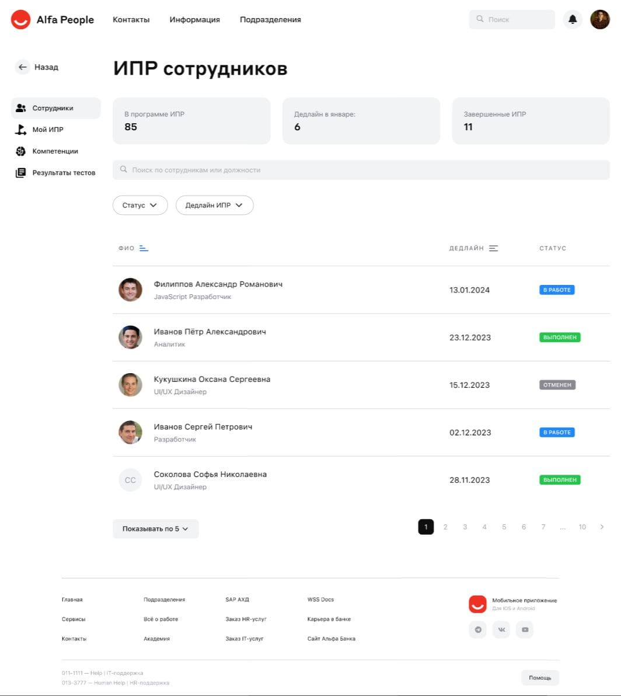

## Frontend для Хакатона от Альфа Банка

## Описание проекта

Этот сервис, в рамках которого для сотрудников можно составлять ИПР (индивидуальные планы развития), просматривать его и валидировать выполнение целей. В рамках сервиса существует 2 роли: руководитель и сотрудник.

## Используемые технологии

- ⚛️[React](https://ru.reactjs.org/)
- 🔧[Redux Toolkit](https://redux-toolkit.js.org/)
- TS [TypeScript](https://www.typescriptlang.org/)

## Инструкции по установке и запуску

1. Клонируйте репозиторий: `git clone git@github.com:hackathon-Alfa-Team-2/alpha-bank-app.git`
2. Перейдите в директорию проекта: `cd alpha-bank-app`
3. Установите зависимости: `npm install`
4. Запустите проект: `npm run dev`

## Скриншоты

